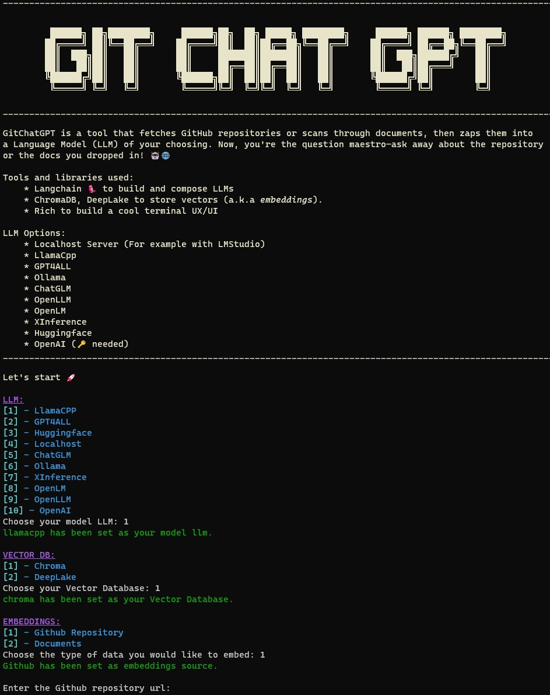

## 🧙‍♂️ Engaging with GitHub Repositories through Conversations
👋 Welcome to the GitChatGPT – a tool designed to clone GitHub repositories and embed them into open-source language models. 🚀 With GitChatGPT, you can ask questions to a GitHub repository. This solution is particularly valuable when you need to embed private repositories, ensuring that your data remains confidential and secure. 🔒

Unfortunately, the results are not as good as I had hoped because the number of tokens for embeddings is limited, and repositories can be very large. Anyway, this tool is a big step in the right direction. I hope you find ways to enhance both the quality and performance.

## 🖥️ CLI


## 🚀 Quick Installation
For Windows (install.bat):
- Run install.bat by double-clicking on it or executing it in the command prompt.

For Linux (install.sh):
- Run install.sh in your terminal by typing ./install.sh and pressing Enter.

## 🔧 Manual Installation
```bash
git clone https://github.com/jsonjuri/gitchatgpt
```
```bash
pip install -r requirements.txt
```
```bash
python cli.py
```

Don't forget to rename env.example to .env and set up the environment variables in the `.env` file.

## 🔍 LLM Configuration

Each Language Model (LLM) in this tool has its own configuration file located in the `/env` directory. Before using the tool, we recommend configuring the settings according to your preferences. Here's how:
1. Navigate to the `/env` directory in your project.
2. Locate the `.env` file associated with the specific LLM you're working with.
3. Open the `.env` file using a text editor of your choice.
4. Set the values for the configuration variables to your preferred settings. Refer to the comments in the file for guidance on each variable.

Now that you've configured the settings, you're ready to use GitChatGPT! Run GitChatGPT with your specified configurations to enjoy a personalized and optimized coding experience.

## 🤖 Model Configuration & Download
Please check the [README](/models/README.md) in the models directory for more information about the folder structure.

#### Download some models below to get started:
**LLamaCPP**:
- [xwin-lm-7b-v0.1.Q5_K_M.gguf](https://huggingface.co/TheBloke/Xwin-LM-7B-V0.1-GGUF/resolve/main/xwin-lm-7b-v0.1.Q5_K_M.gguf) ➡️ ./models/llamacpp/

**GPT4ALL**:
- [ggml-gpt4all-j-v1.3-groovy.bin](https://gpt4all.io/models/ggml-gpt4all-j-v1.3-groovy.bin) ➡️ ./models/gpt4all/
- [ggml-gpt4all-l13b-snoozy.bin](https://gpt4all.io/models/ggml-gpt4all-l13b-snoozy.bin) ➡️ ./models/gpt4all/

## 🌐 Local Webserver (Recommended)
We highly recommend using [LM Studio](https://lmstudio.ai). With LM Studio, you can effortlessly host your own server and customize your models and settings seamlessly. No need to make changes to the code! Follow these simple steps:

1) 📦 Download [LM Studio](https://lmstudio.ai) and install it.
2) 🔧 Start LM Studio and load your preferred model with just a click.
3) 🌐 Navigate to the Local Server tab in LM Studio, and choose 'Run Server.' This sets up your local server for a personalized experience.
4) 🚀 When launching RepoWizard, opt for the 'Localhost Server' option. This ensures RepoWizard connects seamlessly to your locally hosted server.

## 🐳 Docker with Streamlit
```bash
docker compose -p gitchatgpt up -d --build
````

## 🧠 Supported LLMs
- Localhost Server
- LLama.cpp
- Ollama (broken)
- GPT4ALL (broken)
- HuggingFace
- ChatGLM
- OpenLM
- OpenLLM
- OpenAI
- XInference

## ⚙️ Supported Embeddings
- HuggingFace
- OpenAI

## 🤝 Contribution
Just cloning and using this repository won't improve it. Contribute, and together, we can make it even better! 🧙‍♂️ Your creativity and ideas can shape this project into something amazing! 🚀 Together, as an open-source community, we can build a more advanced and powerful tool that benefits everyone. ✨ Your contributions are the key to this project success. 🚀💻

## 🌟 Credits
This tool is built with various powerful libraries and tools to provide efficient functionality. It leverages the capabilities of [LangChain](https://github.com/hwchase17/langchain) for language processing, [Chroma](https://www.trychroma.com/) and [DeepLake](https://www.deeplake.ai/) for vector storage, [SentenceTransformers](https://www.sbert.net/) for sentence embeddings, [LlamaCpp](https://github.com/ggerganov/llama.cpp) for specific language model interactions, and [GPT4All](https://github.com/nomic-ai/gpt4all) for comprehensive language understanding.

## 🔗 Dependencies
- [LangChain](https://github.com/hwchase17/langchain)
- [Chroma](https://www.trychroma.com/)
- [DeepLake](https://www.deeplake.ai/)
- [SentenceTransformers](https://www.sbert.net/)
- [LlamaCpp](https://github.com/ggerganov/llama.cpp)
- [Ollama](https://ollama.com)
- [GPT4All](https://github.com/nomic-ai/gpt4all)

## ⚠️ Warning: 
Using embedding with the OpenAI API for GitHub repositories may result in high costs, especially when dealing with repositories containing many files. It is highly recommended to consider using local language learning models to minimize expenses and ensure cost-effective usage

## 📖 Citation

If you utilize this repository, models or data in a downstream project, please consider citing it with:
```
@misc{gitchatgpt,
  author = {Jsonjuri},
  title = {GitChatGPT: Engage with your github repository code through the power of LLM},
  year = {2023},
  publisher = {GitHub},
  journal = {GitHub repository},
  howpublished = {\url{https://github.com/jsonjuri/gitchatgpt}},
}
```